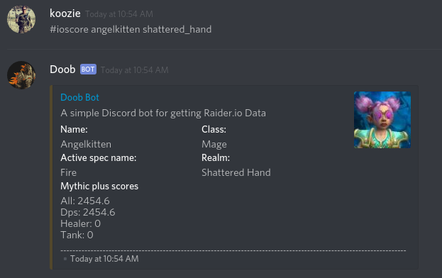
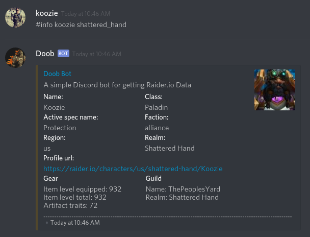

# Doob Bot

A simple Raider.io bot for discord

## To add the bot to a Discord server

1. Click this Discord app [link](https://discordapp.com/oauth2/authorize?client_id=447202191909060613&scope=bot)
2. Choose the discord server where you would like to add the bot.
3. Type a command in a text channel.

## Bot Commands

**Replace any spaces in realm names with an underscore** *(ie. shattered hand becomes shattered_hand)*

### All commands require a character name and realm name. If no region is given the Bot will default to US

|Command                                            |Description                                                 |
|---------------------------------------------------|------------------------------------------------------------|
|`#info <character> <realm_name> <region>`          | Basic info about character.                                |
|`#ioscore <character> <realm_name> <region>`       | The Raider.io score of a character.                        |
|`#highest <character> <realm_name> <region>`       | Three highest mythic dungeons completed by character.      |
|`#best <character> <realm_name> <region>`          | Three best scoring mythic dungeons completed by character. |

## Screenshots

### #ioscore command

#### #info command

## To set up your own version of the bot

* clone the project: `git clone https://github.com/onnenon/doob_bot.git`

* cd into the project directory and create a virtual environment: `python3 -m venv env`

* copy the env_example environment file: `cp env_example.env .env`

* edit your .env file to have your unique bot token. (*get a bot token by following this [wiki](https://github.com/reactiflux/discord-irc/wiki/Creating-a-discord-bot-&-getting-a-token)*)

* source your .env file to activate your virtual environment, install requirements, and set your BOT_TOKEN as an environment variable: `source .env`

* add the bot to your discord server by going to your unique client ID link: `https://discordapp.com/oauth2/authorize?client_id=<your_client_id>&scope=bot`

* run the app: `python3 doob_bot/__init__.py` *(as long as the process remains running the bot will be online)*

*created by Stephen Onnen July 2018*
